STA5076Z Assignment
================
Blake Cuningham CNNBLA001

-   [Q1: Handwritten digit classification with MNIST data](#q1-handwritten-digit-classification-with-mnist-data)
    -   [Introduction](#introduction)
        -   [Visualising the data](#visualising-the-data)
        -   [Approach](#approach)
        -   [Results](#results)
    -   [Discussion](#discussion)
    -   [Conclusion](#conclusion)
    -   [Analysis details](#analysis-details)
        -   [Identifying appropriate number of principal components](#identifying-appropriate-number-of-principal-components)
        -   [LDA without PCA](#lda-without-pca)
        -   [LDA with PCA](#lda-with-pca)
        -   [QDA with PCA](#qda-with-pca)
        -   [Random forest without PCA](#random-forest-without-pca)
        -   [Random forest with PCA](#random-forest-with-pca)
        -   [Boosting with PCA](#boosting-with-pca)
        -   [SVM without PCA](#svm-without-pca)
        -   [SVM with PCA](#svm-with-pca)
        -   [Deep learning neural network without PCA](#deep-learning-neural-network-without-pca)
-   [Q2: Zillow Prize (Kaggle) - Home value prediction](#q2-zillow-prize-kaggle---home-value-prediction)
    -   [Introduction](#introduction-1)
        -   [Measuring model performance](#measuring-model-performance)
        -   [Training and test separation](#training-and-test-separation)
    -   [Data exploration / description](#data-exploration-description)
    -   [Approach](#approach-1)
    -   [Results](#results-1)
    -   [Analysis](#analysis)
        -   [Linear regression](#linear-regression)
        -   [Linear regression with regularization](#linear-regression-with-regularization)
        -   [Neural Network and Random Forest](#neural-network-and-random-forest)
    -   [Conclusion](#conclusion-1)
-   [References](#references)

Please note: The bulk of this assignment is focused on question 1. The easy comparability of the data was a good opportunity to explore as many techniques as possible (e.g. grid search, cross-validation, principle component analysis). The challenging nature of the data used for question 2 required a more focused approach.

Q1: Handwritten digit classification with MNIST data
====================================================

Introduction
------------

The MNIST data-set has been widely used to develop and test classification techniques since it was originally made available in 1998 (LeCun and Cortes 2010). The original curators of the data-set keep track of classification accuracy on their website: they originally achieved a 99.2% accuracy with SVM, and 99.3% accuracy with a boosted convolutional network, but recent best performance is 99.77% by Cireşan, Meier, and Schmidhuber (2012) using a committee of convolutional neural networks.

This project looks at a subset of the data (only considering half of the full 10 digit labels: 0, 1, 2, 4, 7), which means that the results of this work are not directly comparable to the previous research.

### Visualising the data

The data is stored as an entry with 784 fields - one for each pixel of a 28x28 image. Each of these pixels contains a value from 0 to 255 signifying the color gradient. In Figure 1 the first 15 observations in the training data-set are visualized by turning each observation into a matrix. Even from this small sample it can be seen that these are not especially neatly written digits, which makes the challenge even more interesting.

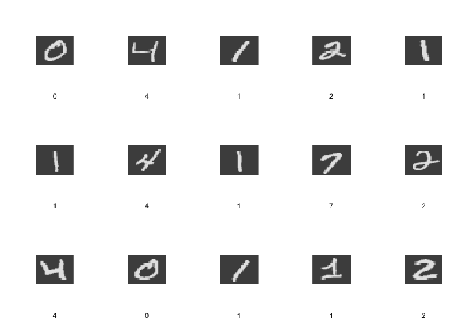

*Figure 1: Visualization of first 15 images in training data*

### Approach

Several different classifiers are used in this assignment to produce accurate predictions, but the choice of classifiers available is too large to try all of them. Notably, this assignment does not make use of K-Nearest Neighbors, nor does it make use of logistic regression. The former exclusion is due to potential computational demands, while the latter is based on the recommendation that logistic regression is not used for multiple classes (James et al. 2013).

Within the set of classifiers chosen, there are several different versions that are possible - where appropriate, a grid methodology was used to find the optimal hyper-parameters for these classifiers. Additionally, classifiers were trained with both the raw data, and principal components of the data. The primary goal of using principal components was to attempt to reduce computation time, but there are some interesting cases where it also aids predictive accuracy. The final comparison of these classifiers only considers the optimized version of each (i.e. lowest classification error hyper-parameters and number of principal components).

Note that when using the original non-PCA data for training and test data, the predictor variables (i.e. pixels) that never contain any information (i.e. are always constant at 0) were removed. There were no non-zero constant columns detected.

### Results

The final, and key, results are summarized in Table 1 below. A short description of the results is below the table. In the very next section the major observations from these results are discussed, followed by some concluding remarks. A more detailed discussion of each classifier can be found in the section titled "Analysis details".

*Table 1: Summary of main models used to classify MNIST data*

| Classifier              | Hyper parameters                       | Training accuracy | Test accuracy | PCA? |
|:------------------------|:---------------------------------------|:------------------|:--------------|:-----|
| Deep learning NN        | Act: Rect + dropout, H layers: 400-400 | 99.82%            | 99.19%        | NA   |
| Support Vector Machines | Cost: 100                              | 100.00%           | 99.17%        | 59   |
| Random Forest           | Trees: 200, Minimum leaves: 3          | 99.79%            | 98.60%        | NA   |
| Support Vector Machines | Cost: 100                              | 100.00%           | 98.47%        | NA   |
| QDA                     | NA                                     | 98.11%            | 98.18%        | 59   |
| Boosting                | I depth: 3, L rate: 0.02, Trees: 1000  | 99.57%            | 98.10%        | 59   |
| Random Forest           | Trees: 500, Minimum leaves: 3          | 99.76%            | 97.94%        | 59   |
| LDA                     | NA                                     | 95.72%            | 95.97%        | 186  |
| LDA                     | NA                                     | 95.96%            | 95.66%        | NA   |

These results represent the classification accuracy on both the training and test sets of information for each of the main classifiers. More detailed results can be found in the "Analysis details" section. For computationally intensive classifiers, such as boosting, the results shown are based on a limited number of iterations and may not actually reflect the true optimal hyper-parameters. Two primary insights can be drawn from an initial view of the results:

1.  More complex non-parametric classifiers were generally more accurate at predicting classes
2.  A small amount of principal components were able to produce one of the most predictive classification models

Discussion
----------

The best performing classifier was a deep neural network trained using the h2o.deeplearning function available from the h2o package in R. This classifier was trained using the original data (i.e. not principal components), and consisted of two hidden layers each with 400 neurons. The model used the rectifier activation function, which has been known to work well for image data. Additionally, the model had an input dropout ratio of 0.2, and hidden layer dropout ratios of 0.5 for both. The model achieved the best accuracy after ~30 epochs. It's possible that a far better neural network could be chosen, but it seems likely that a rectifier activation function and more than one hidden layer would be key features. No neural network was fitted with the PCA training data, so it is unclear whether or not this would be advantageous to predictive accuracy.

Surprisingly, the next best classifier was SVM with just 59 principal components. This SVM used a radial kernel, with a gamma of ~0.017 (the default parameter value defined by 1/(*d**i**m**e**n**s**i**o**n*)). While it is not surprising that SVM performed well, the improved accuracy using PCA instead of the original data shows that despite there being 784 predictor variables, less than a tenth of that number contains the same (or more) information in PCA form. In Figure 4 one can already see quite clear separation between different classes based on just the first two principal components, which enables the SVM and kernel to construct highly predictive hyper-planes.

The worst performing classifier by a considerable distance was Linear Discriminant Analysis (LDA). This was expected given the non-linear qualities of the data, and the likelihood that co-variance matrices between classes would not be identical (QDA performed significantly better, demonstrating the need to allow differing co-variances). However, this simple classifier did demonstrate the trade-off between bias and variance by actually having a better accuracy with the test data than with the training data. The LDA trained with the PCA data performed better, which is to be expected since PCA helps to make the classes more linearly separable.

Boosting performance is arguably inconclusive. Firstly, it was only trained with PCA data, but we can see that the related Random Forest approach performed better with the original data. Secondly, the amount of time needed to train a boosting model (compounded by a grid search, and cross-validation) limited the amount of trees used to 1000. Hence, the best performing boosting model had an interaction depth of 3 (the highest option) and a learning rate of 0.02 (the highest option). It is possible than one, or all, of the others may outperform this version (and potentially the other classifiers) given a much larger amount of trees (and the original training data).

Please see "Analysis details" for additional comments and justifications on model choice (including PCA choices).

Conclusion
----------

The primary conclusion of the analysis points towards more complex non-parametric approaches having better predictive accuracy with this particular data-set. The relatively simple neural network used here suggests that further investigation of these kinds of models could improve predictive accuracy. Indeed, the best performing models in the literature are convolutional neural networks.

It is also recommended that more work is done to investigate boosting models, specifically by fitting with more trees (orders of magnitude more than 1000). Additionally, these boosting models should consider the original image data, and not principal components.

Finally, further improvements in the training of these models may include adding artificially distorted versions of the training data. In Nielsen (2015) it is suggested that images are rotated by an arbitrary amount, and then added to the training data - this would enable models to more robustly recognize digits even if they were presented at an angle. Furthermore, James et al. (2013) were able to improve predictive accuracy by up to 0.5% by including versions of the training data that were "elastically distorted" in order to add more real world variation.

Analysis details
----------------

### Identifying appropriate number of principal components

As explained in James et al. (2013),

> When faced with a large set of correlated variables, principal components allow us to summarize this set with a smaller number of representative variables that collectively explain most of the variability in the original set.

Hence, using this transformation of the data it is expected that it was possible to predict classes at a similar performance level as the original data, but with less computational requirements. Additionally, principal components may "lead to less noisy results" (James et al. 2013) which could therefore help to improve the predictive accuracy of our models above training with the original data.

As seen in Figure 2, the first few principal components account for much larger amounts of variance than those ranked lower. If this plot were to be plotted cumulatively, the effect would be even more drastic. The question is "how many principal components to use?". We need enough in order to capture all the "signal" in the data, but not too much that we start capturing an impactful amount of "noise".

Again, to quote James et al. (2013),

> Unfortunately, there is no well-accepted objective way to decide how many principal components are enough.

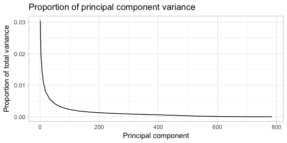

*Figure 2: Proportion of variance explained by components*

It is often suggested to look for the "elbow" in the data by just "eye-balling" it in order to find where principal components turn from explaining a decent amount of variance to little variance. This assignment proposes a method identifying the second derivative of the amount of variance explained by each principal component. The justification is as follows:

-   The first derivative would explain the slope of Figure 2 (which is always negative), but we are more interested in where the slope changes significantly.
-   The second derivative would explain the rate of change of the slope, and the highest second derivatives would indicate where the rate of change of the slope was maximized. This is chosen as a proxy for the "elbow".

Since we are also interested in reducing the amount of principal components for computational reasons, only the first 250 principal components are considered for this analysis. Figure 3 shows the top 4 candidates for these "elbow" points.

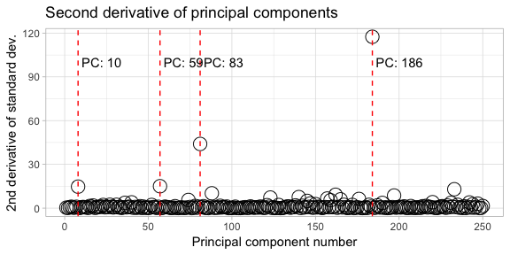

*Figure 3: Selecting potential PCA elbow points via 2nd derivative of variance*

These principal component points will be used in model fitting to identify which amount of components is optimal for the classifier (as opposed to testing the full amount of principal components on an incremental basis, which would not be useful for reducing the computational burden).

In order to visualize the idea behind principal components in the MNIST data-set, Figure 4 demonstrates how just the first 2 components are able to demonstrate quite clear clusters of the categories in a 2-dimensional space. This shows how relatively few principal components could help us predict classes.

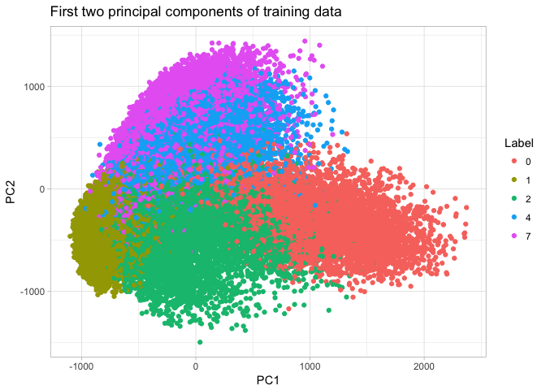

*Figure 4: Category separation by first two principal components of training data*

### LDA without PCA

The first classifier used is Linear Discriminant Analysis (LDA). This is the simplest classifier. Using the non-PCA data the training classification error was 95.96%.

*Table 2: Confusion matrix of LDA model on training data*

|     |     0|     1|     2|     4|     7|    Sum|
|-----|-----:|-----:|-----:|-----:|-----:|------:|
| 0   |  5800|     5|    79|     8|    18|   5910|
| 1   |    14|  6620|   205|    40|   108|   6987|
| 2   |    65|    79|  5512|    54|    64|   5774|
| 4   |    36|    22|   129|  5690|   207|   6084|
| 7   |     8|    16|    33|    50|  5868|   5975|
| Sum |  5923|  6742|  5958|  5842|  6265|  30730|

The test classification error was 95.66%. This was the least accurate classifier of all those tried.

*Table 3: Confusion matrix of LDA model on test data*

|     |    0|     1|     2|    4|     7|   Sum|
|-----|----:|-----:|-----:|----:|-----:|-----:|
| 0   |  963|     0|    14|    3|     1|   981|
| 1   |    1|  1121|    46|    6|    25|  1199|
| 2   |    2|    10|   936|   11|    18|   977|
| 4   |    8|     3|    28|  955|    26|  1020|
| 7   |    6|     1|     8|    7|   958|   980|
| Sum |  980|  1135|  1032|  982|  1028|  5157|

### LDA with PCA

In order to classify the data using the PCA training data, all the elbow points were tried:

*Table 4: Optimal number of principal components for LDA model*

|     |  Training accuracy|  Test accuracy|
|-----|------------------:|--------------:|
| 10  |              92.28|          92.13|
| 59  |              94.83|          95.11|
| 83  |              95.30|          95.62|
| 186 |              95.72|          95.97|

The optimal amount of principal components was 186 which has a training accuracy of 95.72%.

*Table 5: Confusion matrix of LDA model on training data*

|     |     0|     1|     2|     4|     7|    Sum|
|-----|-----:|-----:|-----:|-----:|-----:|------:|
| 0   |  5780|     4|    87|     6|    18|   5895|
| 1   |    15|  6613|   211|    43|   108|   6990|
| 2   |    75|    89|  5455|    60|    67|   5746|
| 4   |    44|    20|   153|  5684|   189|   6090|
| 7   |     9|    16|    52|    49|  5883|   6009|
| Sum |  5923|  6742|  5958|  5842|  6265|  30730|

The test accuracy was 95.97%. This is a small 0.3% improvement over the non-PCA data. Also, interestingly, the test accuracy is better than the training accuracy suggesting low variance for this classifier.

*Table 6: Confusion matrix of LDA model on test data*

|     |    0|     1|     2|    4|     7|   Sum|
|-----|----:|-----:|-----:|----:|-----:|-----:|
| 0   |  962|     0|    15|    1|     0|   978|
| 1   |    1|  1119|    35|    7|    25|  1187|
| 2   |    5|    11|   946|   13|    17|   992|
| 4   |    6|     4|    28|  957|    21|  1016|
| 7   |    6|     1|     8|    4|   965|   984|
| Sum |  980|  1135|  1032|  982|  1028|  5157|

### QDA with PCA

QDA was not able to fit a model based on the raw data, even after the zero-only variables were removed. Because of this, QDA was only investigated with the principal component data. Again, the optimal amount of principal components was investigated:

*Table 7: Optimal number of principal components for QDA model*

|     |  Training accuracy|  Test accuracy|
|-----|------------------:|--------------:|
| 10  |              95.87|          96.24|
| 59  |              98.11|          98.18|
| 83  |              98.04|          98.00|
| 186 |              97.75|          97.27|

The optimal amount of components was 59, with a training classification accuracy of 98.11%.

*Table 8: Confusion matrix of QDA model on training data*

|     |     0|     1|     2|     4|     7|    Sum|
|-----|-----:|-----:|-----:|-----:|-----:|------:|
| 0   |  5890|     0|    11|     6|    13|   5920|
| 1   |     2|  6496|     1|     3|     9|   6511|
| 2   |    27|   187|  5916|    36|   124|   6290|
| 4   |     4|    44|    16|  5774|    46|   5884|
| 7   |     0|    15|    14|    23|  6073|   6125|
| Sum |  5923|  6742|  5958|  5842|  6265|  30730|

The test classification accuracy was 98.18%. Again, this was better than the training accuracy which indicates low variance of the classifier. The accuracy is better than both LDA models, and a random forest approach trained on principal components.

*Table 9: Confusion matrix of LDA model on test data*

|     |    0|     1|     2|    4|     7|   Sum|
|-----|----:|-----:|-----:|----:|-----:|-----:|
| 0   |  977|     0|     2|    0|     0|   979|
| 1   |    0|  1105|     0|    0|     3|  1108|
| 2   |    2|    27|  1024|    6|    34|  1093|
| 4   |    0|     3|     3|  975|     9|   990|
| 7   |    1|     0|     3|    1|   982|   987|
| Sum |  980|  1135|  1032|  982|  1028|  5157|

### Random forest without PCA

A basic random forest approach was trained using the default number of variables tried at each split (approximately the square root of the amount of predictors). In order to speed up computational time, only 200 trees were allowed but it is possible that more trees would have further improved test performance given the large difference found between training and test accuracy.

The training classification accuracy was very high at 99.79%, with 0 being the easiest to classify, and 7 being the most difficult.

*Table 10: Confusion matrix of random forest model on training data*

|     |     0|     1|     2|     4|     7|    Sum|
|-----|-----:|-----:|-----:|-----:|-----:|------:|
| 0   |  5921|     0|     0|     2|     0|   5923|
| 1   |     1|  6728|     1|     3|     8|   6741|
| 2   |     0|    10|  5936|     1|     7|   5954|
| 4   |     1|     2|     9|  5834|     4|   5850|
| 7   |     0|     2|    12|     2|  6246|   6262|
| Sum |  5923|  6742|  5958|  5842|  6265|  30730|

However, test accuracy was just 98.60%, which is high but may be higher if more trees were used in model.

*Table 11: Confusion matrix of random forest model on test data*

|     |    0|     1|     2|    4|     7|   Sum|
|-----|----:|-----:|-----:|----:|-----:|-----:|
| 0   |  977|     0|     9|    1|     1|   988|
| 1   |    0|  1130|     1|    0|     6|  1137|
| 2   |    2|     5|  1009|    6|    23|  1045|
| 4   |    0|     0|     4|  973|     2|   979|
| 7   |    1|     0|     9|    2|   996|  1008|
| Sum |  980|  1135|  1032|  982|  1028|  5157|

However, looking at the classification error plotted against the number of trees it doesn't seem clear that more trees would be helpful as test error seems to have minimized at around 100 trees. Perhaps more versions with differing minimum leaf amounts, or different amounts of variables allowed at each split, could have yielded a better classifier.

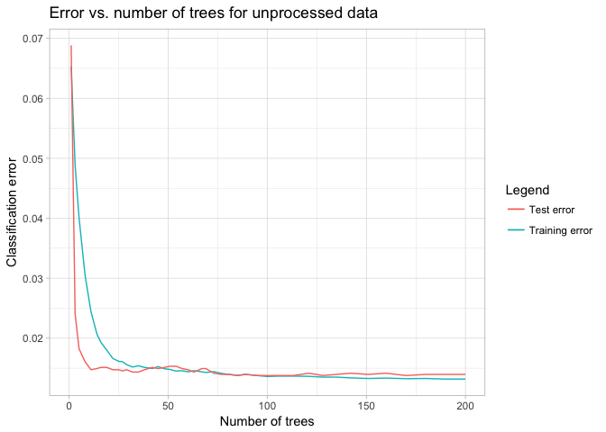 *Figure 5: Decline in classification error with number of trees*

### Random forest with PCA

Looking at the optimal amount of principal components for the random forest model, again 59 components is optimal:

*Table 12: Optimal number of principal components for random forest model*

|     |  Training accuracy|  Test accuracy|
|-----|------------------:|--------------:|
| 10  |              97.15|          97.11|
| 59  |              97.85|          98.07|
| 83  |              97.76|          97.84|
| 186 |              97.62|          97.73|

Training accuracy increases up to 99.76% when using 500 trees.

*Table 13: Confusion matrix of random forest model on principal component training data*

|     |     0|     1|     2|     4|     7|    Sum|
|-----|-----:|-----:|-----:|-----:|-----:|------:|
| 0   |  5923|     0|     2|     1|     1|   5927|
| 1   |     0|  6722|     1|     9|     8|   6740|
| 2   |     0|    14|  5938|     5|     7|   5964|
| 4   |     0|     3|     6|  5826|     1|   5836|
| 7   |     0|     3|    11|     1|  6248|   6263|
| Sum |  5923|  6742|  5958|  5842|  6265|  30730|

But, test classification accuracy of 97.94% is significantly lower indicating that the random forest is over-fitting to the training data.

*Table 14: Confusion matrix of random forest model on principal component test data*

|     |    0|     1|     2|    4|     7|   Sum|
|-----|----:|-----:|-----:|----:|-----:|-----:|
| 0   |  974|     0|    11|    3|     1|   989|
| 1   |    1|  1125|     0|    2|    10|  1138|
| 2   |    4|     9|   998|    7|    23|  1041|
| 4   |    0|     1|     8|  969|     9|   987|
| 7   |    1|     0|    15|    1|   985|  1002|
| Sum |  980|  1135|  1032|  982|  1028|  5157|

The optimal number of trees is quite low - there does not seem to be any significant improvement beyond approximately 40 trees.

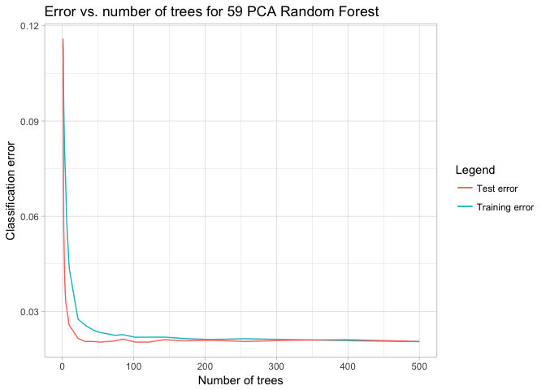 *Figure 6: Decline in classification error with number of trees*

Random Forest classification appears to perform better on the original data than with PCA data. This is likely due to a random forest being able to identify the most important variables quite quickly without the need for PCA. In fact, PCA may hinder a random forest as too much information may be contained in certain components - randomly leaving these components out in trees could be detrimental. A bagging approach may therefore perform better (not tried in this assignment).

### Boosting with PCA

One potential method to improve on random forest, is boosting. The method has several similarities to random forest, but the algorithm uses the error of trees to learn and build sequential trees. Because this method takes this sequential approach, it is difficult to perform it in parallel, and it can take a long time to compute. For these reasons, only PCA data was used - at the 59 PCA level because this was found to be best for random forest, and because it is relatively few which would further aid computation.

In order to find the hyper-parameters for an optimal boosting model, a grid approach was taken in order to consider two key parameters:

-   Interaction depth
-   Learning rate

Other parameters were left as default (e.g. minimum observations per leaf at 10), and the number of trees was set at 1000 only. For cross-validation, 4 folds were selected. The results of the grid search can be seen in Table 15. In general, the CV error was quite close to the actual test data error indicating that it would have been adequate if we did not have the test data available. The best performing model has an interaction depth of 3, and a learning rate of 0.02, which are both the maximum out of the two parameters.

*Table 15: Ordered results of grid search for optimal boosting model*

|  Depth|  Learning rate|  Training error|  CV error (4 fold)|  Test set error|
|------:|--------------:|---------------:|------------------:|---------------:|
|      3|          0.020|           0.004|              0.022|           0.019|
|      2|          0.020|           0.016|              0.026|           0.023|
|      3|          0.010|           0.015|              0.028|           0.024|
|      2|          0.010|           0.028|              0.035|           0.031|
|      3|          0.005|           0.029|              0.037|           0.032|
|      1|          0.020|           0.039|              0.044|           0.041|
|      2|          0.005|           0.046|              0.050|           0.045|
|      1|          0.010|           0.058|              0.061|           0.057|
|      1|          0.005|           0.085|              0.089|           0.082|
|      3|          0.001|           0.080|              0.083|           0.077|
|      2|          0.001|           0.110|              0.114|           0.107|
|      1|          0.001|           0.173|              0.174|           0.164|

Figure 7 compares the test error vs. number of trees for all the models. We can see the best performing model has the lowest error at 1000 trees, but all models are still decreasing at this point meaning that more trees are needed in order to confirm the optimal parameters. Because the optimal model at 1000 trees had the highest learning rate, and the largest interaction depth, it seems likely that a different model would actually perform better at a 10 000 or 100 000 tree mark.

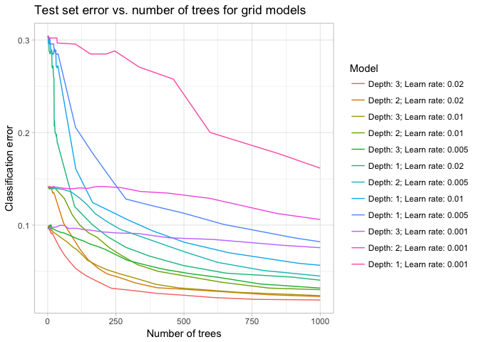 *Figure 7: Comparing boosting model test error vs. number of trees*

The training classification accuracy of the optimal 1000 tree model was 99.57%.

*Table 16: Confusion matrix of boosting model on principal component training data*

|     |     0|     1|     2|     4|     7|    Sum|
|-----|-----:|-----:|-----:|-----:|-----:|------:|
| 0   |  5917|     0|     5|     2|     1|   5925|
| 1   |     0|  6722|     4|    11|    11|   6748|
| 2   |     2|    10|  5917|     4|    14|   5947|
| 4   |     3|     3|    13|  5816|    12|   5847|
| 7   |     1|     7|    19|     9|  6227|   6263|
| Sum |  5923|  6742|  5958|  5842|  6265|  30730|

The test classification accuracy was 98.10%, which is disappointingly lower than the random forest without PCA data.

*Table 17: Confusion matrix of boosting model on principal component test data*

|     |    0|     1|     2|    4|     7|   Sum|
|-----|----:|-----:|-----:|----:|-----:|-----:|
| 0   |  973|     0|    10|    2|     2|   987|
| 1   |    0|  1127|     2|    1|     8|  1138|
| 2   |    6|     8|   999|    6|    16|  1035|
| 4   |    0|     0|     8|  967|     9|   984|
| 7   |    1|     0|    13|    6|   993|  1013|
| Sum |  980|  1135|  1032|  982|  1028|  5157|

The classification error of the chosen boosting model seems to flatten out at 1000 trees:

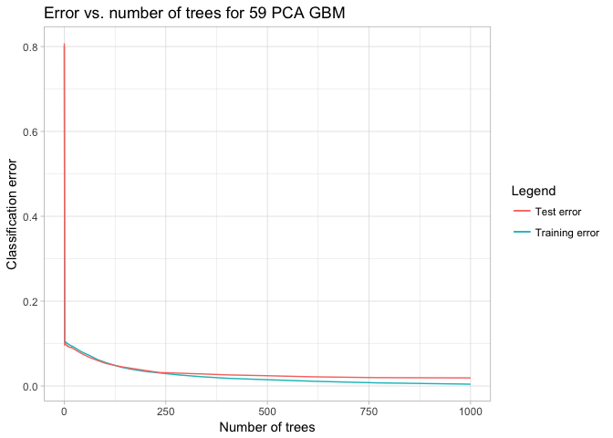 *Figure 8: Decline in classification error with number of trees*

It would be interesting to apply a boosting model to the non-PCA data using an interaction depth of 1, and a learning rate of 0.001 (the worst performer at 1000 trees), and run it for a couple of orders of magnitude higher than 1000 trees.

### SVM without PCA

Support Vector Machines are able to construct highly predictive hyper-planes around classes using a kernel approach. In this case, a radial kernel was used. The cost was set to 100 - an arbitrary number that may improve model performance if changed. No grid search was applied here to test this parameter, nor was the gamma variable changed from the default value.

The training classification accuracy for the non-PCA data was 100.00%. You can't do better than this, but we know that there is potentially a significant amount of noise in the non-PCA data, and so this could be significantly over-fitting.

*Table 18: Confusion matrix of SVM model on training data*

|     |     0|     1|     2|     4|     7|    Sum|
|-----|-----:|-----:|-----:|-----:|-----:|------:|
| 0   |  5923|     0|     0|     0|     0|   5923|
| 1   |     0|  6742|     0|     0|     0|   6742|
| 2   |     0|     0|  5958|     0|     0|   5958|
| 4   |     0|     0|     0|  5842|     0|   5842|
| 7   |     0|     0|     0|     0|  6265|   6265|
| Sum |  5923|  6742|  5958|  5842|  6265|  30730|

As expected, the test classification error was much lower at 98.47%, which is just slightly better than QDA. The next step is to train an SVM model using less noisy PCA data.

*Table 19: Confusion matrix of SVM model on test data*

|     |    0|     1|     2|    4|     7|   Sum|
|-----|----:|-----:|-----:|----:|-----:|-----:|
| 0   |  968|     0|     4|    1|     1|   974|
| 1   |    1|  1130|     3|    0|     5|  1139|
| 2   |    6|     4|  1017|   18|    17|  1062|
| 4   |    4|     0|     2|  961|     3|   970|
| 7   |    1|     1|     6|    2|  1002|  1012|
| Sum |  980|  1135|  1032|  982|  1028|  5157|

### SVM with PCA

Because of the ability of PCA to help remove noisy variation in the training data, it is expected to aid predictive accuracy in SVM by allowing hyper-planes to be more clearly drawn around classes. The optimal amount of principal components was determined to be 59, even though all but the 10 component level yielded 100.00% training accuracy. The test accuracy for 59 components is the highest, and it is also the simplest, making it the strongest choice (see Table 20).

*Table 20: Optimal number of principal components for SVM model*

|     |  Training accuracy|  Test accuracy|
|-----|------------------:|--------------:|
| 10  |              99.68|          98.12|
| 59  |             100.00|          99.17|
| 83  |             100.00|          99.13|
| 186 |             100.00|          98.86|

As mentioned, training accuracy was the highest possible 100.00%.

*Table 21: Confusion matrix of SVM model on PCA training data*

|     |     0|     1|     2|     4|     7|    Sum|
|-----|-----:|-----:|-----:|-----:|-----:|------:|
| 0   |  5923|     0|     0|     0|     0|   5923|
| 1   |     0|  6742|     0|     0|     0|   6742|
| 2   |     0|     0|  5958|     0|     0|   5958|
| 4   |     0|     0|     0|  5842|     0|   5842|
| 7   |     0|     0|     0|     0|  6265|   6265|
| Sum |  5923|  6742|  5958|  5842|  6265|  30730|

Test classification accuracy was very high too at 99.17%. This is the best performance out of all classifiers tried thus far.

*Table 22: Confusion matrix of SVM model on PCA test data*

|     |    0|     1|     2|    4|     7|   Sum|
|-----|----:|-----:|-----:|----:|-----:|-----:|
| 0   |  977|     0|     3|    0|     0|   980|
| 1   |    0|  1130|     2|    0|     2|  1134|
| 2   |    2|     2|  1020|    4|    12|  1040|
| 4   |    0|     2|     2|  977|     4|   985|
| 7   |    1|     1|     5|    1|  1010|  1018|
| Sum |  980|  1135|  1032|  982|  1028|  5157|

It can be concluded that PCA is a very helpful transformation of image data when using SVM to train a classifier. Also, it is worth noting that the SVM model took minimal computation time despite producing such accurate results.

### Deep learning neural network without PCA

Finally, a neural network approach is considered. The h2o.deeplearning function was used to fit all considered models. In order to find the optimal model, two hyper-parameters were varied:

-   The activation function
-   The number of neurons in each layer

Each model had an input layer dropout ratio of 0.2, and hidden layer dropout ratios of 0.5. Additionally, *l*1 regularization was used. These regularization methods were used in order to prevent over-fitting of any of the models, and so were not included in the grid search. This initial grid search was allowed 20 epochs.

The results in Table 23 show that the best performing model had two hidden layers of 400 neurons each, and used the Rectifier activation function (a function that takes the maximum of *x* or 0).

*Table 23: Ordered results of grid search for optimal deep learning model*

| Hidden layers | Activation function  |  Training error|  Test set error|
|:--------------|:---------------------|---------------:|---------------:|
| 400-400       | RectifierWithDropout |           0.002|           0.008|
| 100-400       | RectifierWithDropout |           0.006|           0.011|
| 400-100       | RectifierWithDropout |           0.004|           0.010|
| 100-100       | RectifierWithDropout |           0.008|           0.016|
| 400           | TanhWithDropout      |           0.008|           0.015|
| 400-400       | TanhWithDropout      |           0.011|           0.017|
| 400           | RectifierWithDropout |           0.003|           0.012|
| 100-400       | TanhWithDropout      |           0.018|           0.023|
| 100           | TanhWithDropout      |           0.021|           0.026|
| 100-100       | TanhWithDropout      |           0.021|           0.024|
| 400-100       | TanhWithDropout      |           0.020|           0.023|
| 100           | RectifierWithDropout |           0.008|           0.018|

Three key observation can be observed in Figure 9:

1.  The sigmoidal TanH activation function performed very poorly
2.  Two hidden layers were generally better performers than single hidden layers
3.  TanH activation function was quite unstable over the progression of epochs (see Figure 9)

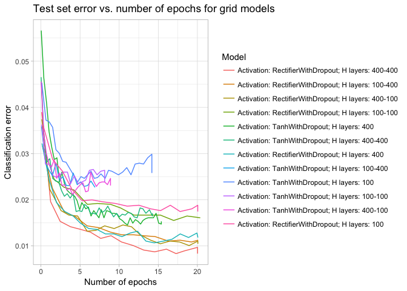 *Figure 9: Comparing deep learning model test error vs. number of epochs*

Therefore, the best performing model over 20 epochs was retrained with an allowable 100 epochs. However, best performance was achieved after approximately 30 epochs - as can be seen in Figure 10. The training classification accuracy of this model is extremely high at 99.82%.

*Table 24: Confusion matrix of deep learning model on training data*

|     |     0|     1|     2|     4|     7|    Sum|
|-----|-----:|-----:|-----:|-----:|-----:|------:|
| 0   |  5923|     1|     3|     1|     1|   5929|
| 1   |     0|  6724|     3|     4|     3|   6734|
| 2   |     0|     6|  5944|     3|     9|   5962|
| 4   |     0|     2|     2|  5832|     1|   5837|
| 7   |     0|     9|     6|     2|  6251|   6268|
| Sum |  5923|  6742|  5958|  5842|  6265|  30730|

The test classification accuracy of 99.19% is marginally higher than SVM trained with PCA, which makes neural networks the best performing classifier in this assignment. Additionally, the difference between training error and test error is smaller than with SVM suggesting that a neural network offers better variance.

*Table 25: Confusion matrix of deep learning model on test data*

|     |    0|     1|     2|    4|     7|   Sum|
|-----|----:|-----:|-----:|----:|-----:|-----:|
| 0   |  975|     0|     4|    2|     1|   982|
| 1   |    1|  1131|     3|    0|     1|  1136|
| 2   |    1|     3|  1018|    4|    10|  1036|
| 4   |    1|     1|     1|  975|     0|   978|
| 7   |    2|     0|     6|    1|  1016|  1025|
| Sum |  980|  1135|  1032|  982|  1028|  5157|

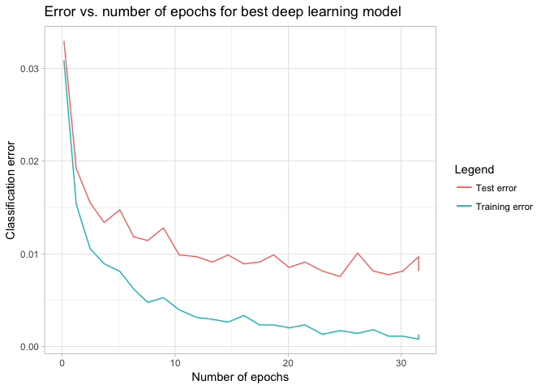 *Figure 10: Decline in classification error with number of epochs*

Other neural networks that could be tried in order to improve accuracy may have more layers, or a different amount of neurons in the layers (perhaps 300-300, or 500-500, or 500-500-500). Additionally, they may attempt higher or lower dropout ratios.

Q2: Zillow Prize (Kaggle) - Home value prediction
=================================================

Introduction
------------

The data-set explored in this section comes from a recent Kaggle competition - "Zillow Prize: Zillow's Home Value Prediction (Zestimate)". The company Zillow is a property search website, well known for being able to produce a number called a "Zestimate" which is their best calculation of a specific home's selling price. The Zestimate is considered to be typically accurate within a few percentage points, and has helped the company grow rapidly over the last 10 years. Zillow is looking for an improvement over their current pricing algorithm which is why they have made this data available.

The data consists of a large number of numeric and categorical predictors, with an unusual response variable: The log error of the Zestimate, i.e.:

*l**o**g**e**r**r**o**r* = *l**o**g*(*Z**e**s**t**i**m**a**t**e**t*)−*l**o**g*(*A**c**t**u**a**l**S**a**l**e**P**r**i**c**e**t*)

This aspect of the data poses an analytical challenge - if we assume that the Zestimate estimates have been accurately produced to begin with, then there will likely be very little information contained within the response variable.

### Measuring model performance

The primary measure of accuracy will be Mean Absolute Error (MAE) defined as:

$$MAE = \\frac{\\sum\_{i=1}^{n} |\\hat{y\_i} - y\_i|}{n} $$

This is the measure used by the Kaggle competition, and will allow us to compare predictive accuracy between various different models based on the test data. However, it's important to note that in general we are looking to outperform a specific number given by:

$$MAE\_{benchmark} = \\frac{\\sum\_{i=1}^{n} |\\bar{y} - y\_i|}{n}$$
 The comparison of the two measures is similar to calculating a coefficient of determination, except the error terms are absolute values and not squares. The reason for using an absolute error instead of squared error is to ensure that large deviations from zero are not overly weighted - this may change the dynamic of the Kaggle competition where participants look for patterns to only identify specific very large deviations and simply use the mean to predict all others.

### Training and test separation

The data supplied contains transaction information for the whole of 2016. The data is then split as follows:

-   Training data: full data before 1 October 2016
-   Test data: a portion of data after 1 October 2016 (but before 2017). The remaining data is kept secret by Zillow in order to use this unseen test data for comparison.

The Kaggle output format is very specific, but this assignment will just consider the MAE of the test data.

Data exploration / description
------------------------------

The key characteristic of this data is that there is very little deviation from the mean of ~0, and it is normally distributed around this mean. Also, there are several very large outliers where the Zestimate has significantly differed from actual sale prices. It is unclear whether or not this is caused by a poor Zestimate prediction, or an anomaly in the specific sale.

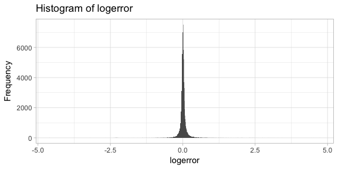

*Figure 11: Histogram of logerror (response variable) for training data*

The second characteristic pertains to the predictor variables. There is a lot of missing information:

    ## `summarise_each()` is deprecated.
    ## Use `summarise_all()`, `summarise_at()` or `summarise_if()` instead.
    ## To map `funs` over all variables, use `summarise_all()`

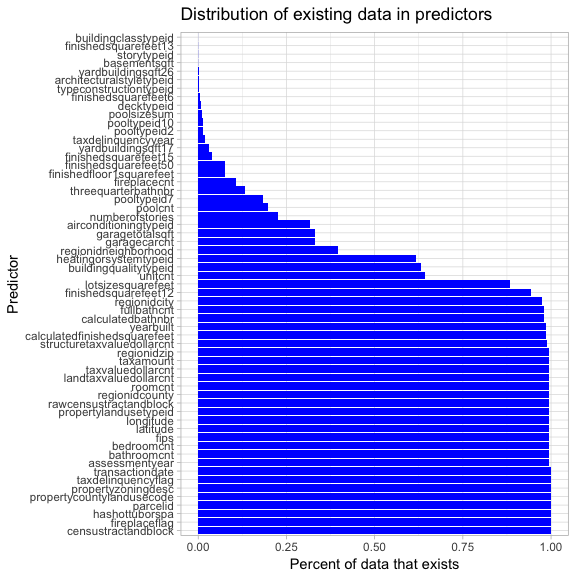

*Figure 12: Amount of available data in full data set*

There are several ways to approach this problem, including imputing the missing values, but for this assignment the relatively empty predictors are excluded from the training data - those with less than ~85% values missing (there is a clear inflection point below this). Additionally, obviously highly correlated variables are removed (e.g. "bathroomcnt" is removed because we have "calculatedbthnbr" as well).

Then, within each of the predictors, there is very little discernible relationship to the response variable. For example, in the figure below the logerror vs. the year houses were built is plotted - the actual observations are in black, the year means are in red, and the 99% confidence interval is the blue shaded area. The confidence interval is not even discernible for most of the years showing just how little the response variable varies with this predictor. The relationship with other predictors behaves in a similar way. Additionally, even though there is some variation in earlier years for this data, the confidence interval covers both positive and negative regions meaning that there is unlikely significant information here.

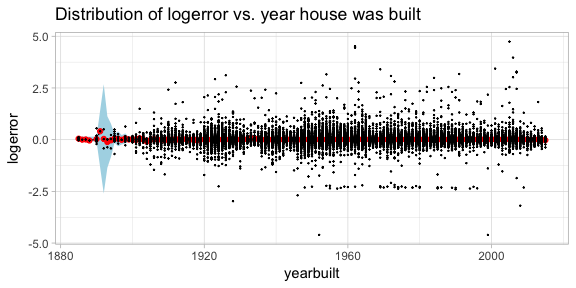

*Figure 13: Distribution of logerror versus year built*

However, despite the weak evidence of a relationship upon visual inspection, there does exist a strong relationship between year the house was built and logerror after conducting a simple linear regression. The relationship is very small (around one tenth of a percent), but it is significant far beyond a 1% level. This result is primarily due to the very high number of observations that we have in the data-set (~80 000 in the training set). Additionally, there are possibly combinations of predictors that are even more predictive.

*Table 26: Simple linear model of year built and logerror*

|             |    Estimate|  Std. Error|    t value|  Pr(&gt;|t|)|
|-------------|-----------:|-----------:|----------:|------------:|
| (Intercept) |  -0.2143894|   0.0468019|  -4.580781|      4.6e-06|
| yearbuilt   |   0.0001145|   0.0000238|   4.815629|      1.5e-06|

The results are not shown here (because of space constraints), but there are a large amount of predictive variables after taking into account all the categorical dummy variables. This further indicates that there will be a group of variables that would perform well in a multiple linear regression.

Approach
--------

This assignment will take a targeted approach, first looking at multiple linear regression, then regularized regression, and then finally reviewing a random forest and two neural networks.

In some cases, certain variables will be left out before searching in order to help reduce the amount of parameters. For example, the "Raw Census Tract and Block" predictor has over 40 000 factors which add too many terms to a regression, and too many input neurons to a neural network. An approach one could potentially take is to extract a few of these factors and identify them, especially if they are associated with large logerrors, and create a new variable with just a handful of factors. This is done after a subset search.

Results
-------

The table below shows the final results of the various approaches. The table is ranked by the test MAE, and the benchmark MAE is second from last.

*Table 27: Summary of main models used to predict test logerror*

| Model                                | Training MAE | Test MAE | Notes                                                      |
|:-------------------------------------|:-------------|:---------|:-----------------------------------------------------------|
| Multiple regression after subsetting | 0.0662       | 0.0641   | 16 predictors used                                         |
| Neural network 1                     | 0.0683       | 0.0654   | 16 subset predictors; (12, 12, 12); Rectifier with dropout |
| Ridge regression                     | 0.0685       | 0.0656   | Lambda chosen at one standard error                        |
| Neural network 2                     | 0.0694       | 0.0657   | All predictors; (200, 200, 200); Rectifier with dropout    |
| Benchmark using training mean        | 0.0696       | 0.066    | NA                                                         |
| Random forest                        | 0.0635       | 0.0674   | 200 trees, 3 minimum observations at leaves                |

Surprisingly, the simplest technique produced the best results - multiple linear regression. While the random forest had the best training MAE, it had the worst test MSE indicating that it was prone to over-fitting the training data. A neural network using the variables subset during the linear regression analysis produced the second best results, followed closely by a ridge regression approach. As will be seen, the ridge regression was not properly able to optimize lambda and resulted in extremely small coefficients resulting in essentially just an intercept forming the model - from this perspective, the only very slight improvement in performance from the neural network is not very impressive.

Analysis
--------

### Linear regression

In order to perform a multiple linear regression, the most important first step is to identify which predictors help to produce a good model. A sub-setting approach was employed in this instance by reviewing both forward and backward selection and finding which variables produced the lowest Bayesian Information Criterion (BIC) - see Figure 14.

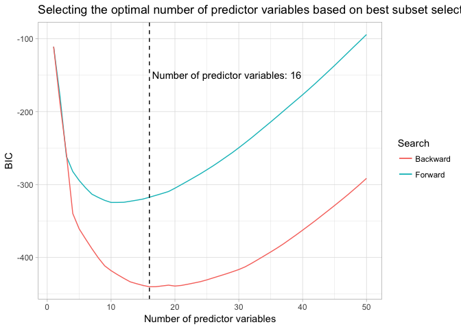

*Figure 14: Using the BIC to select the optimal model based on forward and backward subset selection*

The forward approach (adding variables) resulted in about 10 variables being selected, while a backward approach (removing variables) resulted in 16 variables being selected. The backward approach also produced a far lower BIC curve in general. In Table 28, the variables of the these two optimal points are compared:

*Table 28: Choosing the best predictors from both forward and backwards selection*

| Predictor                     | Forward selection | Backward selection |
|:------------------------------|:------------------|:-------------------|
| (Intercept)                   | TRUE              | TRUE               |
| calculatedfinishedsquarefeet  | TRUE              | TRUE               |
| hashottuborspaTRUE            | TRUE              | TRUE               |
| propertycountylandusecode0101 | NA                | TRUE               |
| propertycountylandusecode040A | NA                | TRUE               |
| propertycountylandusecode200  | NA                | TRUE               |
| propertylandusetypeid247      | NA                | TRUE               |
| propertylandusetypeid248      | NA                | TRUE               |
| propertylandusetypeid263      | NA                | TRUE               |
| regionidcity31134             | TRUE              | TRUE               |
| regionidcity46098             | TRUE              | TRUE               |
| regionidcity50749             | TRUE              | TRUE               |
| regionidcity54299             | TRUE              | TRUE               |
| regionidcity6822              | TRUE              | TRUE               |
| taxamount                     | TRUE              | TRUE               |
| taxdelinquencyflagTRUE        | TRUE              | TRUE               |
| taxvaluedollarcnt             | TRUE              | TRUE               |

All of the predictors selected with the forward approach are contained within the variables selected by the backward approach. Also, interestingly, there were three tax related variables chosen that appeared quite correlated in a co-variance matrix.

*Table 29: Linear model summary*

|                                   |  Estimate|  Std. Error|   t value|  Pr(&gt;|t|)|
|-----------------------------------|---------:|-----------:|---------:|------------:|
| (Intercept)                       |   -0.2706|      0.0492|   -5.4978|       0.0000|
| calculatedfinishedsquarefeet      |    0.0000|      0.0000|   14.5303|       0.0000|
| hashottuborspaTRUE                |   -0.0189|      0.0037|   -5.1117|       0.0000|
| propertycountylandusecode\_2040A  |    1.5443|      0.1614|    9.5662|       0.0000|
| propertycountylandusecode\_2200   |   -0.6612|      0.1613|   -4.0986|       0.0000|
| propertycountylandusecode\_2other |    0.0128|      0.0022|    5.8778|       0.0000|
| propertylandusetypeid\_2248       |   -0.0037|      0.0090|   -0.4168|       0.6768|
| propertylandusetypeid\_2263       |    0.1010|      0.0213|    4.7457|       0.0000|
| propertylandusetypeid\_2other     |    0.0250|      0.0069|    3.6402|       0.0003|
| regionidcity\_246098              |    0.1959|      0.0494|    3.9681|       0.0001|
| regionidcity\_250749              |    0.2612|      0.0492|    5.3067|       0.0000|
| regionidcity\_254299              |    0.1760|      0.0509|    3.4597|       0.0005|
| regionidcity\_26822               |    0.3979|      0.0606|    6.5678|       0.0000|
| regionidcity\_2other              |    0.2300|      0.0486|    4.7271|       0.0000|
| taxamount                         |    0.0000|      0.0000|  -12.9357|       0.0000|
| taxdelinquencyflagTRUE            |    0.0277|      0.0044|    6.3289|       0.0000|
| taxvaluedollarcnt                 |    0.0000|      0.0000|   10.1042|       0.0000|

These variables are then input into a linear regression, with the results summarized in Table 29. Most of the variables are associated with predicting that the Zestimate is over-estimating house prices (a positive logerror). However, these values do not tell us anything in general about actual house prices as we do not have this information.

Next, the training and test MAE is calculated. Both are below the benchmark. While the results do not seem very impressive, it is worth noting that the current best ranked MAE on Kaggle is 0.6418 based on this test data and additional unseen test data.

*Table 30: Linear model performance*

|           |  Training MAE|  Test MAE|
|-----------|-------------:|---------:|
| Benchmark |        0.0696|    0.0660|
| Model     |        0.0662|    0.0641|

### Linear regression with regularization

The next stage of the linear regression is to add regularization by way of ridge regression. This is a method of adding a parameter penalty to the cost function. The size of the penalty is given by *λ* (lambda). In order to estimate the optimal lambda, cross-validation is used on the training data to investigate how the training error changes with lambda - lambda is chosen at one standard error from the minimum lambda. In this case, the standard error is very large and therefore so is lambda.

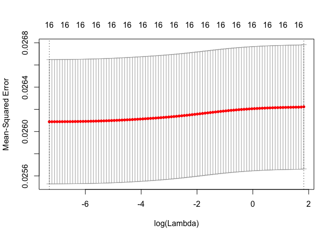

*Figure 15: Log of lambda and model error*

As lambda increases, the coefficients of the linear regression are decreased (as in Figure 16). In this case, the chosen lambda is so high as to reduce coefficients to near zero - this results in a model that is effectively only an intercept term.

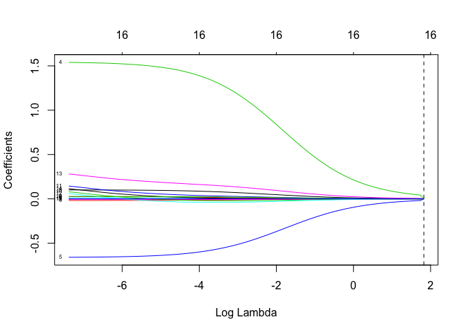

*Figure 16: Model coefficients decrease with lambda*

Using the regularized model, the training and test MAE are calculated. The model does managed to beat the benchmark, but only just. It did not perform as well as a pure linear regression.

*Table 31: Ridge regression model performance*

|           |  Training MAE|  Test MAE|
|-----------|-------------:|---------:|
| Benchmark |        0.0696|    0.0660|
| Model     |        0.0685|    0.0656|

### Neural Network and Random Forest

Given the complex nature of the data, a more complex non-parametric approach is worth considering. First, a random forest with 200 trees, and a minimum of 3 observations allowed at each leaf is used with the variables subset during the linear regression stage. The model performs better than all others in terms of the training MAE, but worse than all others in terms of the test MAE. A larger random forest based on the un-subset data may perform better, but it was not tried here.

*Table 32: Random Forest model performance*

|           |  Training MAE|  Test MAE|
|-----------|-------------:|---------:|
| Benchmark |        0.0696|    0.0660|
| Model     |        0.0635|    0.0674|

Next, two different neural networks are considered. The first uses the subset variables, and the second uses all the original variables. Both models use a Rectifier activation function, and have three hidden layers. Both have an input dropout ratio of 0.2, and hidden dropout ratios of 0.5. The first model structure is (12, 12, 12), and marginally outperforms the benchmark. The model optimized after just 5 epochs.

*Table 33: Small neural network model performance*

|           |  Training MAE|  Test MAE|
|-----------|-------------:|---------:|
| Benchmark |        0.0696|    0.0660|
| Model     |        0.0683|    0.0654|

A more complex model using the un-subsetted data is tried next. In order to account for the significantly increased amount of predictor variables (~400 including all factors) a large network is constructed: (200, 200, 200). However, the model did not perform as well as the smaller network suggesting the possibility that the additional variables only added noise.

*Table 34: Large neural network model performance*

|           |  Training MAE|  Test MAE|
|-----------|-------------:|---------:|
| Benchmark |        0.0696|    0.0660|
| Model     |        0.0694|    0.0657|

Conclusion
----------

The data-set was challenging to work with, only allowing the ability to detect extremely small improvements - the Zillow model has been developed over the course of at least ten years by multiple data scientists. However, it is encouraging that some improvement possibility was detected with just a linear regression. In order to improve these results, the following next steps are suggested:

1.  Add external data
2.  Impute missing values
3.  Add interactions between variables
4.  Add quadratic variables
5.  Try additional regression models

References
==========

Cireşan, Dan, Ueli Meier, and Juergen Schmidhuber. 2012. “Multi-column Deep Neural Networks for Image Classification,” February. doi:[10.1109/CVPR.2012.6248110](https://doi.org/10.1109/CVPR.2012.6248110).

James, Gareth, Daniela Witten, Trevor Hastie, and Robert Tibshirani. 2013. *An Introduction to Statistical Learning*. Vol. 103. Springer Texts in Statistics. New York, NY: Springer New York. doi:[10.1007/978-1-4614-7138-7](https://doi.org/10.1007/978-1-4614-7138-7).

LeCun, Yann, and Corinna Cortes. 2010. “MNIST handwritten digit database.” *AT&T Labs \[Online\]. Available: Http://Yann. Lecun. Com/Exdb/Mnist*. <http://yann.lecun.com/exdb/mnist/>.

Nielsen, Michael A. 2015. “Neural Networks and Deep Learning.” <http://neuralnetworksanddeeplearning.com/chap3.html>.
